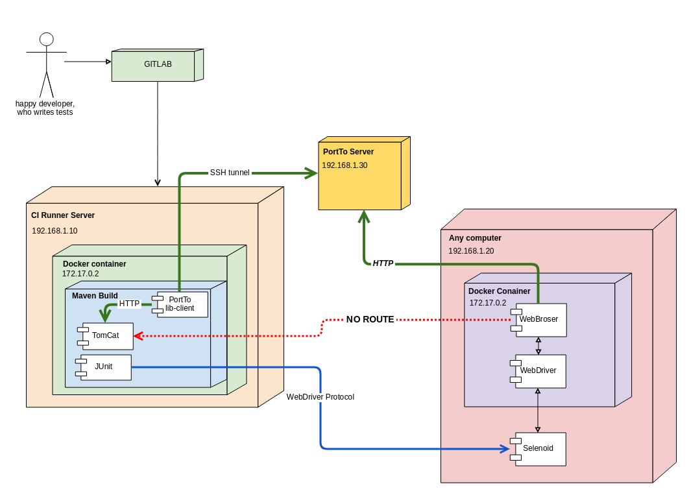

#### WARNING!!! Not implemented. Status: in progress

## About 
**PortTo** - tools for the exposing localhost port to a developer office network or internet.

**Motivation:** I  want to use @SpringBootTest and Selenium Grid. 
A test is run from Gitlab-CI in a Docker container. Browser (selenium) is run in a Docker container.
All this is run in the office network. 

I want to have an annotation @PortTo which gives me "host:port" reachable from Internet.

P.S. 

serveo.net - my inspiration. Not self-hosted version.  
ngrok - beautiful and paid service.  
forwardhq.com - paid service.  
 

**My work environment:**

## How it's work?

The client library opens **ssh tunnel** to **PortTo Server** and uses "remote port forwarding".
WebBrowser sends requests to \<portToServer:forwardingPort\>. PortTo Server forwards requests to the client localhost interface from the open tunnel.   

## Security
